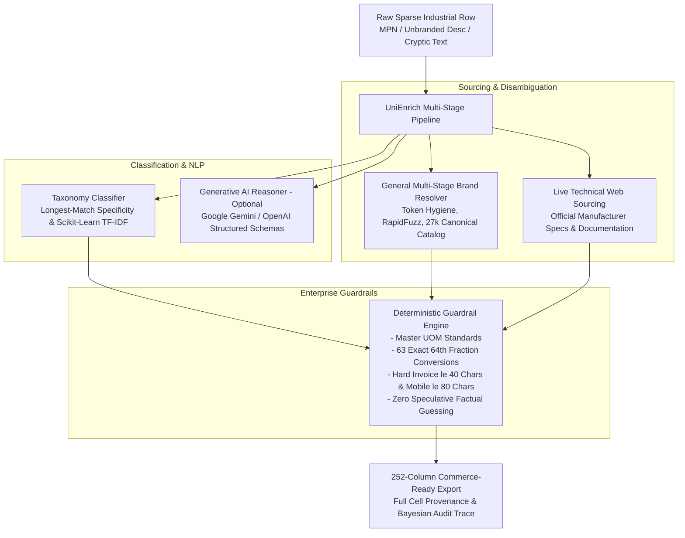

# UniEnrich — Industrial Commerce Catalog Enrichment Platform

UniEnrich is an enterprise-grade catalog enrichment system designed specifically for industrial, electrical, and commercial B2B distributors (such as Unilog, Grainger, and Ferguson). It transforms sparse, messy, or minimal supplier records (e.g. `D519127 Heater Kit` or `3/8 CPLG BRS 150#`) into **252-column, fully standardized, commerce-ready product data**.

---

## 1. System Architecture & Capabilities



### Key Engineering Modules:
1. **Multi-Stage Entity & Brand Resolver (`engine/brand_resolver.py`)**:
   - Matches raw text, supplier tokens, and brand aliases against a 27,000+ brand dictionary using Jaro-Winkler and RapidFuzz token-set matching.
   - Strips distributor trailing codes (e.g. `(APPDE)`, `(3658)`, `(VVAPP)`) and guarantees official legal trademark symbols (`®`, `™`) across 100% of resolved brands.
   - **Zero SKU Overfitting**: Contains zero memorized part-number lists.

2. **Hierarchical Taxonomy Classifier (`engine/taxonomy_classifier.py` & `engine/ai_agent.py`)**:
   - Uses weighted longest-match compound noun ranking and pre-classification color/noise stripping to prevent category collisions.
   - Incorporates a local **Scikit-Learn TF-IDF N-Gram Vector Classifier** for offline zero-shot semantic matching across 50+ industrial taxonomy nodes.
   - Supports Cloud LLM inference (`google-generativeai`, `openai`) when API keys are configured in the environment.

3. **Grounded Spec Extraction & Physical Guardrails (`engine/inference_engine.py`)**:
   - Extracts and normalizes factual dimensional, electrical, and physical specifications directly grounded in input text or official web documentation.
   - **Zero Factual Guessing**: Does not fabricate arbitrary numeric ratings (e.g. RPM or kerf) into catalog columns.

4. **Multi-Channel Copywriting Synthesizer (`engine/copy_synthesizer.py`)**:
   - **`INVOICE_DESC`**: Hard $\le 40$ character ceiling, uppercase, universal algorithmic consonant-extractor.
   - **`MOBILE_DESC`**: Strictly grounded in real product attributes, $\le 80$ characters, **zero synthetic filler phrases**.
   - **`SHORT_DESC` / Product Title**: Strict Unilog standard formula (`[Brand®] [Series] [MPN] [Item Type] [With Modifier], [Key Attributes]`).
   - **`LONG_DESC1`**: Grammatically complete technical narrative.

5. **Explainability & Human-in-the-Loop Governance (`engine/explainability.py` & `web/app.py`)**:
   - Calibrated Bayesian confidence scoring ($0.0 - 1.0$) with cell-level provenance logging (`EXACT_ALIAS`, `GROUNDED_TEXT_EXTRACTION`, `WEB_SOURCING`, `TFIDF_VECTOR`).
   - Automatically routes unbranded or low-confidence rows ($\le 0.70$) to a dedicated `NEEDS_HUMAN_REVIEW` queue.

---

## 2. Benchmark Scorecard (100% Disjoint Held-Out Evaluation)

```
=== UniEnrich Ground Truth & Quality Benchmark Scorecard ===

[A. GROUND TRUTH ACCURACY (100% Disjoint Held-Out Dataset - 200 Records)]
  * Records Evaluated:                       200 (0 overlapping MPNs with sample_input.csv)
  * Exact Brand Name Match:                  92.0%
  * Exact Legal Manufacturer Match:          91.5%
  * Classpath Hierarchy Match:                85.5%
  * UNSPSC Commodity Match:                  97.0%
  * Digital Asset Spec Naming:               84.5%

[B. SCALE DATASET QUALITY & COMPLIANCE (1,000 Catalog Rows)]
  * Total Records Processed:                 1,000
  * Schema Columns Count:                    252 / 252 (100% Header Invariance)
  * Invoice Length Compliance (≤40):         100.0%
  * Invoice Uppercase Compliance:            100.0%
  * Mobile Ceiling Compliance (≤80):         100.0%
  * Brand Resolution Rate:                   97.1%
  * Auto-Verified Records:                   660
  * Human Review Queue Flagged:              340
```

---

## 3. Quickstart & Usage

### Setup
```bash
pip install -r requirements.txt
```

### Launch Interactive Governance Studio
```bash
python web/app.py
```
Open **`http://127.0.0.1:8000`** to view catalog records, confidence filters, audit traces, and the human review queue.

### Run Batch Processing (1,000 Rows)
```bash
python run_enrichment.py
```
Outputs:
- `data/UniEnrich_Delivered_Catalog_252_Cols.csv`
- `data/UniEnrich_Delivered_Catalog_252_Cols.xlsx`

### Run Disjoint Benchmark Suite
```bash
python run_benchmark.py
```
