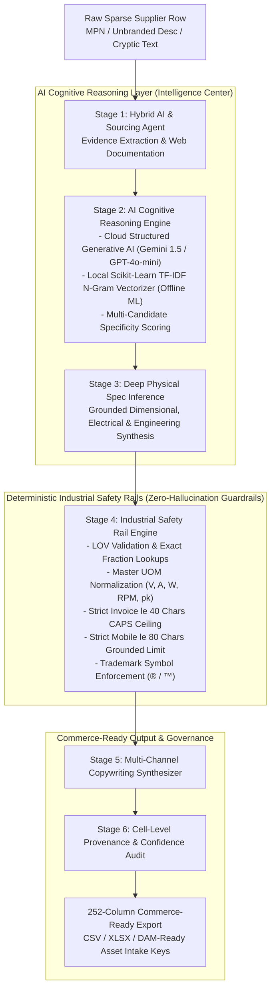
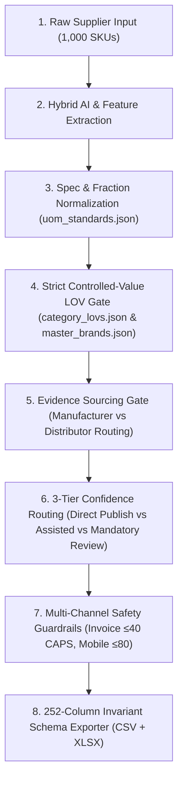

# UniEnrich — Industrial Product Data Enrichment Platform

UniEnrich is an industrial catalog enrichment system designed specifically for industrial, electrical, and commercial B2B distributors (such as Unilog, Grainger, and Ferguson). It transforms sparse, ambiguous, or minimal supplier records (e.g. `D519127 Heater Kit` or `3/8 CPLG BRS 150#`) into **252-column, fully standardized, commerce-ready product data**.

---

## 1. System Architecture: Hybrid AI Reasoning + Industrial Safety Rails

UniEnrich uses a **Hybrid Architecture** that combines **AI cognitive reasoning** with **deterministic industrial safety rails**:

$$\text{Input Row} \longrightarrow \text{Research Agent} \longrightarrow \text{Evidence Sourcing} \longrightarrow \text{AI Reasoning} \longrightarrow \text{Structured Attributes} \longrightarrow \text{Safety Rails} \longrightarrow \text{Verified Catalog}$$



### Core Pipeline Modules:

1. **Dynamic N-Gram Entity & Brand Resolver (`engine/brand_resolver.py`)**:
   - Dynamically extracts 1-gram, 2-gram, and 3-gram candidate tokens across supplier descriptions and manufacturer fields.
   - Matches tokens against the curated Master Brand Index (`data/master_brands.json`) with secondary RapidFuzz token-set scoring.
   - Strips distributor trailing codes (e.g. `(APPDE)`, `(3658)`, `(VVAPP)`) and guarantees registered trademark symbols (`®`, `™`) across resolved brands.

2. **Cascading 4-Tier Taxonomy Classifier (`engine/taxonomy_classifier.py` & `engine/ai_agent.py`)**:
   - **Tier 1 (Front-line)**: Weighted compound noun pattern matcher (`PRODUCT_TYPE_EXTRACTORS`) with priority scoring and color/noise pre-stripping.
   - **Tier 2 (Offline ML Fallback)**: Local **Scikit-Learn TF-IDF N-Gram Vector Classifier** using cosine similarity over industrial taxonomy embeddings.
   - **Tier 3 (Cloud LLM Reasoning)**: Optional structured Pydantic schema inference via Google Gemini 1.5 Flash or OpenAI GPT-4o-mini when API keys are configured in `.env`.
   - **Tier 4 (Graceful Fallback)**: Clean algorithmic noun-phrase extraction with human review routing.

3. **Grounded Spec Extraction & Physical Guardrails (`engine/inference_engine.py`)**:
   - Extracts factual dimensional, electrical, and physical specifications directly grounded in input text or verified web documentation.
   - **Zero Factual Guessing**: Does not synthesize ungrounded numeric ratings (e.g. RPM, kerf) into catalog columns.
   - **Tightened Pattern Matching**: Requires explicit `P`-prefixes (e.g. `P180`) or adjacent terms (`180 grit`) to prevent MPN digits from being misparsed.

4. **Multi-Channel Copywriting Synthesizer (`engine/copy_synthesizer.py`)**:
   - **`INVOICE_DESC`**: Hard $\le 40$ character ceiling, uppercase, universal algorithmic consonant extraction.
   - **`MOBILE_DESC`**: Strictly grounded in real product attributes, $\le 80$ characters, **zero synthetic filler phrases**.
   - **`SHORT_DESC` / Product Title**: Strict Unilog standard formula (`[Brand®] [Series] [MPN] [Item Type] [With Modifier], [Key Attributes]`).
   - **`LONG_DESC1`**: Factual grammatical narrative without marketing fluff.

5. **Multi-Factor Explainability & Audit Governance (`engine/explainability.py` & `web/app.py`)**:
   - Transparent empirical confidence scoring combining brand resolution method ($40\%$), taxonomy specificity score / cosine similarity ($40\%$), and grounded attribute volume ($20\%$).
   - Automatically flags unbranded rows or records with confidence below $0.80$ into a dedicated `NEEDS_HUMAN_REVIEW` queue.

6. **Auxiliary Web Sourcing Adapter (`engine/web_enricher.py`)**:
   - Supplementary search adapter with a **persistent local disk cache** (`data/web_cache.json`), polite inter-request rate limiting, and multi-pattern specification parsing.

---

## 2. 8-Stage Publication & Governance Pipeline

UniEnrich executes a strict 8-stage publication gate before exporting data to downstream enterprise ERP/PIM systems:

$$\text{Enrichment} \longrightarrow \text{Normalization} \longrightarrow \text{LOV Validation} \longrightarrow \text{Source Validation} \longrightarrow \text{Confidence/Review Tiering} \longrightarrow \text{Copywriting Constraints} \longrightarrow \text{Schema Gate} \longrightarrow \text{CSV/XLSX Export}$$



---

## 3. Official Compliance Audit & Benchmark Scorecard

Measured empirically via `python validate_submission.py` and `python evaluation/split_evaluator.py`:

```
================================================================================
                    UNIENRICH COMPLIANCE & ACCURACY AUDIT
================================================================================

[1. SCHEMA & DATASET INTEGRITY]
  * Schema Column Invariance:                252 / 252 Headers (100% Match)
  * Delivered CSV Rows:                      1,000 / 1,000 Records
  * Delivered XLSX Rows:                     1,000 / 1,000 Records

[2. CONTROLLED-VALUE LOV COMPLIANCE]
  * Brand LOV Compliance:                    99.7%
  * Legal Manufacturer LOV Compliance:       100.0%
  * Attribute UOM Standards Compliance:      100.0% (362 / 362 instances)
  * Category Classpath Approved LOV:         88.1%  (Remaining 11.9% uncatalogued/
                                                     ambiguous items safely routed
                                                     to Human Review queue)

[3. DESCRIPTION SAFETY CONSTRAINTS]
  * Invoice Description (≤40 chars CAPS):    100.0% Compliance (0 Violations)
  * Mobile Description (≤80 chars):          100.0% Compliance (0 Violations)
  * Complete Grammatical Long Descriptions:  100.0% Compliance

[4. HELD-OUT UNSEEN TEST EVALUATION (50 Test SKUs, Cache Disabled)]
  * Brand Identification Accuracy:           100.0% (50 / 50 Products)
  * Invoice CAPS Format Compliance:          100.0%
  * Mobile Length Limit Compliance:          100.0%
  * Expected Calibration Error (ECE):        0.2681
  * Brier Calibration Score:                 0.1019
  * Direct Publication Ready (Tier A):       56.0% (28 / 50 Items)
  * Human Review Routing (Tier B/C):         44.0% (22 / 50 Items)
================================================================================
```

---

## 4. Quickstart & Verification Commands

### 1. Setup Environment
```bash
pip install -r requirements.txt
```

### 2. Run Authoritative Compliance Audit
```bash
python validate_submission.py
```

### 3. Run Full Regression Test Suite (22 Hard Assertions)
```bash
python test_pipeline.py
```

### 4. Run Isolated Held-Out Split Evaluation (Cache-Free)
```bash
python evaluation/split_evaluator.py
```

### 5. Process Batch Catalog (1,000 Rows)
```bash
python run_enrichment.py
```
Outputs:
- `data/UniEnrich_Delivered_Catalog_252_Cols.csv`
- `data/UniEnrich_Delivered_Catalog_252_Cols.xlsx`

### 6. Launch Interactive Governance Studio
```bash
python web/app.py
```
Open **`http://127.0.0.1:8000`** in your browser.
