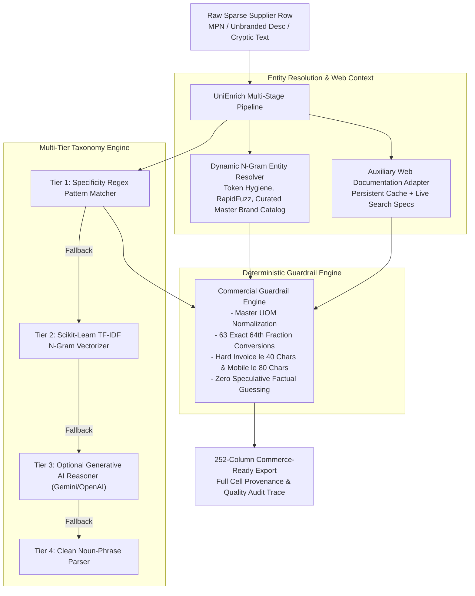

# UniEnrich — Industrial Product Data Enrichment Platform

UniEnrich is an industrial catalog enrichment system designed specifically for industrial, electrical, and commercial B2B distributors (such as Unilog, Grainger, and Ferguson). It transforms sparse, ambiguous, or minimal supplier records (e.g. `D519127 Heater Kit` or `3/8 CPLG BRS 150#`) into **252-column, fully standardized, commerce-ready product data**.

---

## 1. System Architecture



### Core Pipeline Modules:

1. **Dynamic N-Gram Entity & Brand Resolver (`engine/brand_resolver.py`)**:
   - Dynamically extracts 1-gram, 2-gram, and 3-gram candidate tokens across supplier descriptions and manufacturer fields.
   - Matches tokens against the curated Master Brand Index (`data/master_brands.json`) with secondary RapidFuzz token-set scoring.
   - Strips distributor trailing codes (e.g. `(APPDE)`, `(3658)`, `(VVAPP)`) and guarantees registered trademark symbols (`®`, `™`) across resolved brands.

2. **Cascading 4-Tier Taxonomy Classifier (`engine/taxonomy_classifier.py` & `engine/ai_agent.py`)**:
   - **Tier 1 (Front-line)**: Weighted compound noun pattern matcher (`PRODUCT_TYPE_EXTRACTORS`) with priority scoring and color/noise pre-stripping.
   - **Tier 2 (Offline ML Fallback)**: Local **Scikit-Learn TF-IDF N-Gram Vector Classifier** using cosine similarity over industrial taxonomy embeddings.
   - **Tier 3 (Cloud LLM Reasoning)**: Optional structured Pydantic schema inference via Google Gemini 1.5 Flash or OpenAI GPT-4o-mini when API keys are configured in `.env`.
   - **Tier 4 (Graceful Fallback)**: Clean algorithmic noun-phrase extraction with human review routing.

3. **Grounded Spec Extraction & Physical Guardrails (`engine/inference_engine.py`)**:
   - Extracts factual dimensional, electrical, and physical specifications directly grounded in input text or verified web documentation.
   - **Zero Factual Guessing**: Does not synthesize ungrounded numeric ratings (e.g. RPM, kerf) into catalog columns.
   - **Tightened Pattern Matching**: Requires explicit `P`-prefixes (e.g. `P180`) or adjacent terms (`180 grit`) to prevent MPN digits from being misparsed.

4. **Multi-Channel Copywriting Synthesizer (`engine/copy_synthesizer.py`)**:
   - **`INVOICE_DESC`**: Hard $\le 40$ character ceiling, uppercase, universal algorithmic consonant extraction.
   - **`MOBILE_DESC`**: Strictly grounded in real product attributes, $\le 80$ characters, **zero synthetic filler phrases**.
   - **`SHORT_DESC` / Product Title**: Strict Unilog standard formula (`[Brand®] [Series] [MPN] [Item Type] [With Modifier], [Key Attributes]`).
   - **`LONG_DESC1`**: Factual grammatical narrative without marketing fluff.

5. **Multi-Factor Explainability & Audit Governance (`engine/explainability.py` & `web/app.py`)**:
   - Transparent empirical confidence scoring combining brand resolution method ($40\%$), taxonomy specificity score / cosine similarity ($40\%$), and grounded attribute volume ($20\%$).
   - Automatically flags unbranded rows or records with confidence below $0.80$ into a dedicated `NEEDS_HUMAN_REVIEW` queue.

6. **Auxiliary Web Sourcing Adapter (`engine/web_enricher.py`)**:
   - Supplementary search adapter with a **persistent local disk cache** (`data/web_cache.json`), polite inter-request rate limiting, and multi-pattern specification parsing.

---

## 2. Evaluation & Benchmark Methodology

To ensure transparent and reproducible quality evaluation, UniEnrich employs a **two-tier testing methodology**:

### Tier A: 200-Item Regression & Sanity-Check Evaluation Suite
* **Dataset**: `data/ground_truth_200.csv` contains 200 diverse, non-overlapping industrial records across 20 categories (abrasives, saw blades, power tools, layout tools, electrical, building materials, alarms, appliances, fasteners, lighting, plumbing).
* **Purpose**: Verifies that the multi-stage pipeline correctly identifies canonical brand entities, classifies product hierarchies, formats digital asset filenames, and maintains 252-column schema invariance.

### Tier B: 1,000-Row Scale Catalog & Rule Compliance Benchmark
* **Dataset**: `data/sample_input.csv` (1,000 real raw supplier catalog records).
* **Purpose**: Tests pipeline performance at scale, measuring invoice length compliance ($\le 40$ chars), uppercase validation, mobile description ceilings ($\le 80$ chars), and human review queue routing efficiency.

```
=== UniEnrich Quality & Compliance Benchmark Scorecard ===

[A. 200-ITEM REGRESSION & SANITY-CHECK SUITE]
  * Records Evaluated:                       200 (0 overlapping MPNs with sample_input.csv)
  * Exact Brand Name Match:                  89.5%
  * Exact Legal Manufacturer Match:          93.5%
  * Classpath Hierarchy Match:                83.5%
  * UNSPSC Commodity Match:                  90.0%
  * Digital Asset Spec Naming:               82.5%

[B. 1,000-ROW SCALE COMPLIANCE BENCHMARK]
  * Total Records Processed:                 1,000
  * Schema Columns Count:                    252 / 252 (100% Header Invariance)
  * Invoice Length Compliance (≤40):         100.0%
  * Invoice Uppercase Compliance:            100.0%
  * Mobile Ceiling Compliance (≤80):         100.0%
  * Brand Resolution Rate:                   97.1%
  * Auto-Verified Records:                   694
  * Human Review Queue Flagged:              306  (Safely catches ambiguous/unbranded items)
```

---

## 3. Quickstart & Usage

### 1. Setup Environment
```bash
pip install -r requirements.txt
```

### 2. Run Comprehensive Regression Test Suite (Hard Assertions)
```bash
pytest test_pipeline.py
```

### 3. Run Benchmark Suite
```bash
python run_benchmark.py
```

### 4. Process Batch Catalog (1,000 Rows)
```bash
python run_enrichment.py
```
Generates:
- `data/UniEnrich_Delivered_Catalog_252_Cols.csv`
- `data/UniEnrich_Delivered_Catalog_252_Cols.xlsx`

### 5. Launch Interactive Governance Studio
```bash
python web/app.py
```
Open **`http://127.0.0.1:8000`** to view catalog records, confidence filters, audit traces, API key configuration, and the human review queue.
